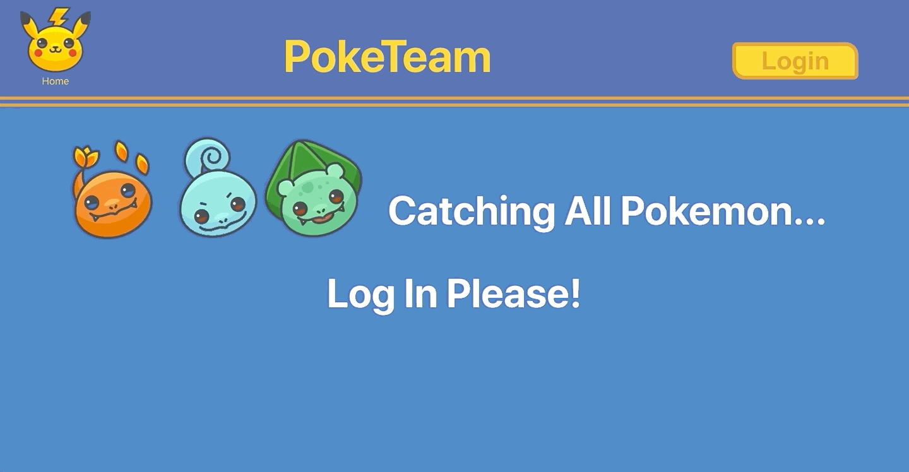
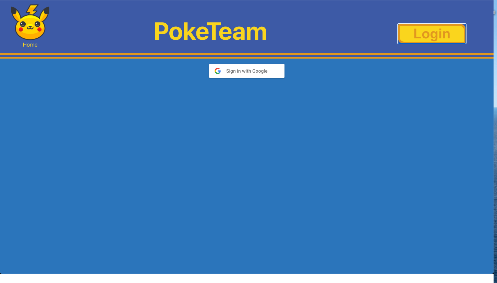
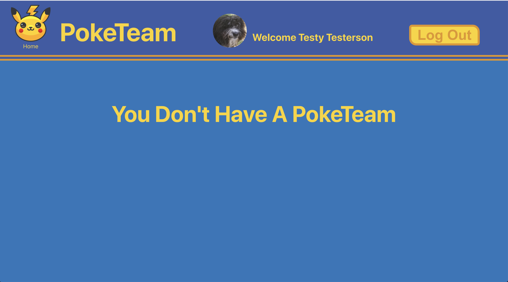
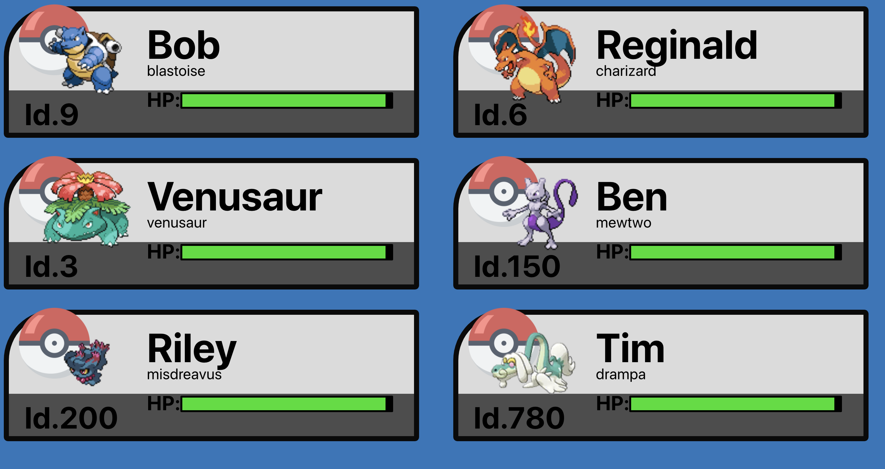

# Stretch-Auth
**Mod 3 Pair Project**  

### Authors

**Jordan Shryock**
 * [GitHub](https://github.com/jordy1611)
 * [LinkedIn](https://www.linkedin.com/in/jordan-shryock-6a48b9113/)

**Horacio Borrego**
 * [GitHub](https://github.com/H-Bo214)
 * [LinkedIn](https://www.linkedin.com/in/horacio-borrego-4a52851b0/)
 
**Ben McClung**
 * [GitHub](https://github.com/AurumValian)
 * [LinkedIn](https://www.linkedin.com/in/benjamin-mcclung-1a1a4b1b6/)

**Naomi Ware**  
 * [GitHub](https://github.com/nware1066)
 * [LinkedIn](https://www.linkedin.com/in/naomi-ware-083332b8/)
 
### Overview  
PokeTeam is an application which allows users to login using a google account and build a team picked from over 800 Pokemon. It is a 4-person, 1 week project which involved the developers to self-teach a new technology (Google Firebase) and impliment an Api of our choosing. We were interested in the massive database of Pokemon information from PokeApi and the opportunity to import, filter and use such a large and complex data model. We were also extremely excited to style the page, as a Pokemon themed page allows for some creative freedoms.

Users can login using their gmail account. Once logged in they can access a form page where they can build & edit their PokeTeam. Users can then view their PokeTeam on the homepage. The PokeTeam displayed on the homepage dynamically changes as the user adds and removes pokemon to their team.

### Technologies and Tools Used
- React
- React Router
- Jest
- Google Firebase
- Git VCS
- GitHub Projects

### Installation Instructions

**Front-end**
- Clone down this repo
- Run `npm install` from the root directory
- Run `npm start` and visit localhost:3000 in your browser

### App Demo

* User sees a loading page first time visiting the page

* User can login in using their Google account

* If a user does not have a poketeam they are prompted to build one

* A user can catch a pokemon by typing in it's pokemon id number or name. User can also give the pokemon a name.

* A user can release a pokemon by clicking it's poke sprite/image.

* User can view their PokeTeam on the homepage

### Credits
* All Pokemon data from [PokeApi](https://pokeapi.co/)
* Icons made by [Smashicons](Smashicons) via [Flaticon](www.flaticon.com)
* Icons made by [Roundicons Freebies](https://www.flaticon.com/authors/roundicons-freebies) via [Flaticon](www.flaticon.com)
